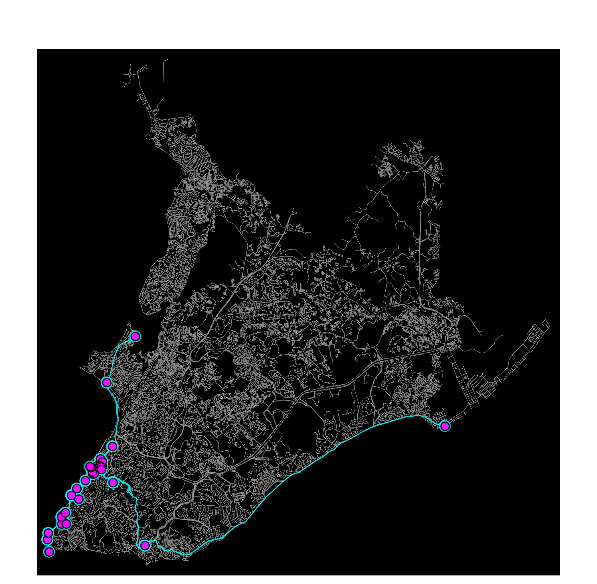
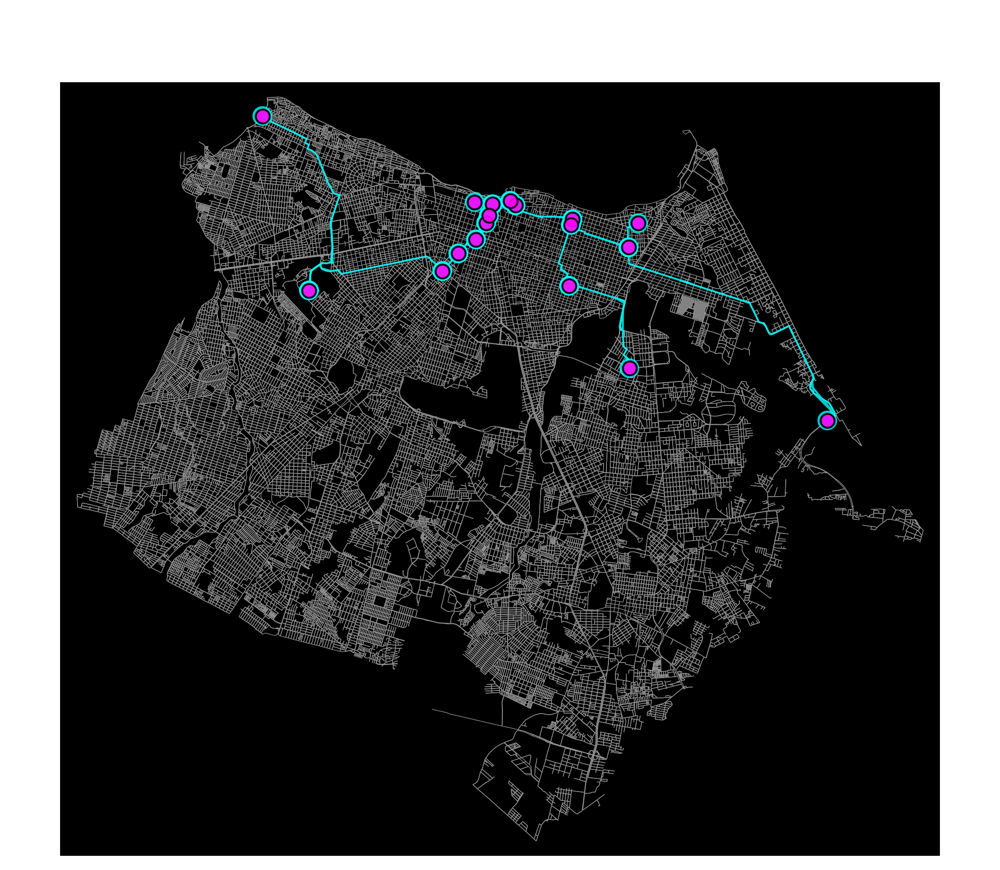
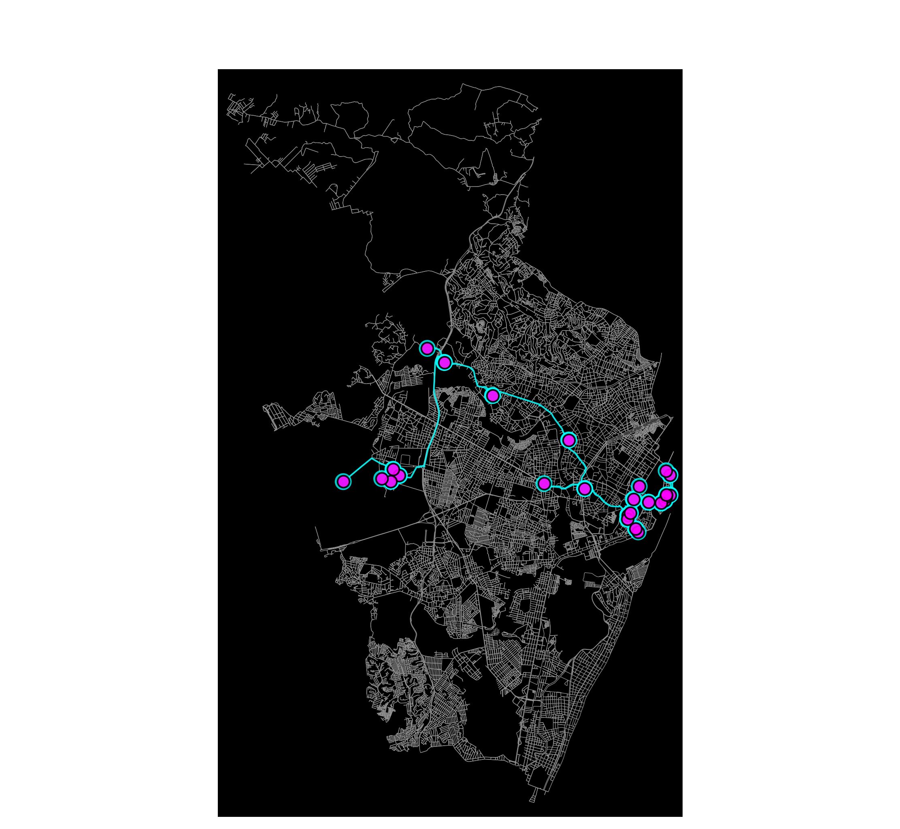
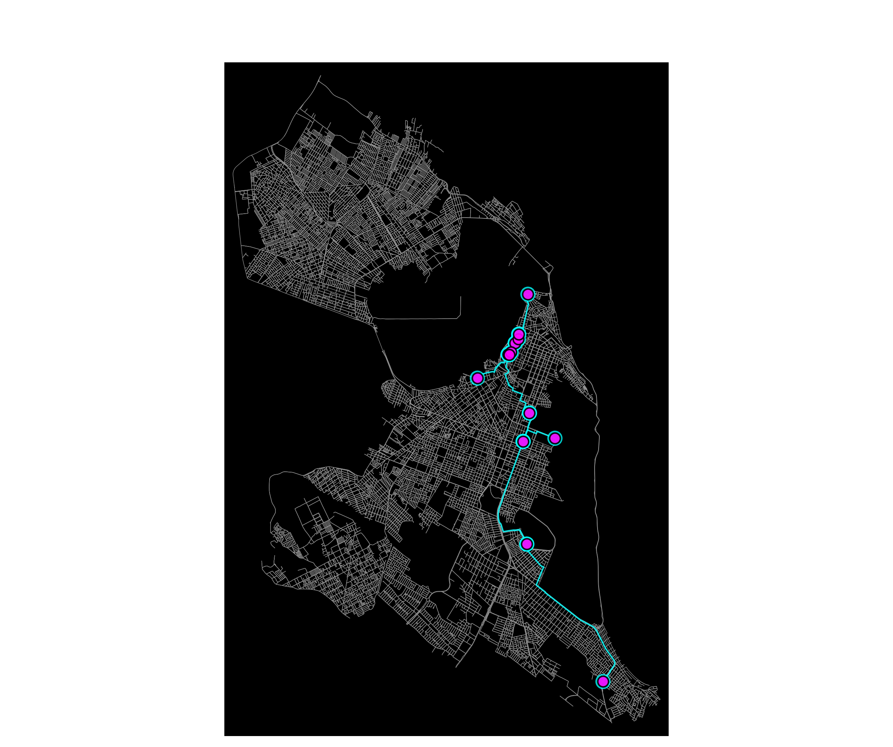
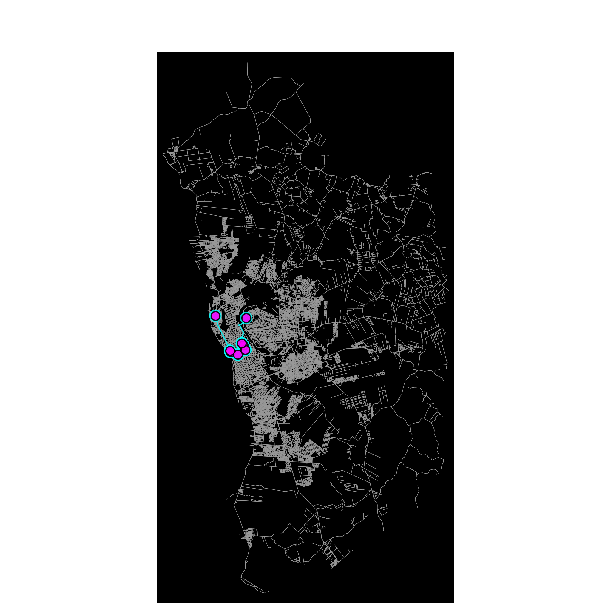
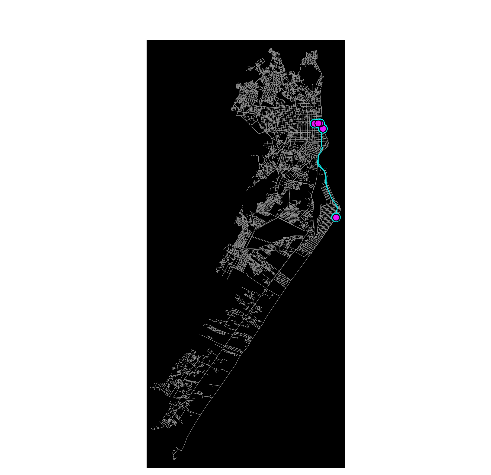

# A* + MST: Ligando Museus por Vias Reais no Nordeste

Este repositório contém um projeto em Python, focado em estimar a quilometragem mínima de vias reais necessárias para interligar um conjunto de Pontos de Interesse (POIs).

O projeto utiliza **museus (`'tourism': 'museum'`)** como POIs e analisa **9 capitais do Nordeste brasileiro**, e segue as orientações apresentadas na disciplina de Algoritmos e Estruturas de Dados II (DCA3702 - UFRN).

## 🧭 Sumário

* [1. Objetivo do Projeto](#1-objetivo-do-projeto)
* [2. Metodologia Aplicada](#2-metodologia-aplicada)
* [3. Ferramentas e Dependências](#3-ferramentas-e-dependências)
* [4. Como Executar](#4-como-executar)
* [5. Resultados Obtidos](#5-resultados-obtidos)
    * [5.1. Tabela Comparativa](#51-tabela-comparativa)
    * [5.2. Visualizações por Cidade](#52-visualizações-por-cidade)
* [6. Análise Crítica](#6-análise-crítica)
* [7. Autores](#7-autores)

## 1. 🎯 Objetivo do Projeto

O objetivo principal é, dado um conjunto de POIs em uma cidade, estimar quantos quilômetros de vias reais são suficientes para interligá-los.

Para isso, o método combina o algoritmo **A*** para calcular as rotas mais curtas na malha viária e, em seguida, constrói uma **Árvore Geradora Mínima (MST)** sobre um grafo completo onde os POIs são vértices e as arestas são ponderadas pelo custo (distância) da rota A*.

## 2. 🗺️ Metodologia Aplicada

A análise em cada cidade seguiu os seguintes passos, implementados no notebook `main.ipynb`:

1.  **Aquisição do Grafo Viário:** O grafo viário da cidade é baixado usando `osmnx.graph_from_place`.
2.  **Aquisição dos POIs:** Os museus são buscados na área do grafo usando `osmnx.features_from_place(tags={'tourism': 'museum'})`.
3.  **Projeção Métrica:** O grafo é projetado para o sistema de coordenadas **UTM** (`ox.project_graph`) para permitir cálculos de distância em metros.
4.  **Cálculo das Rotas A*:** É criado um novo grafo completo `T` onde cada nó é um POI. O peso da aresta entre cada par de POIs (A, B) é definido como a distância real da rota viária, calculada usando `networkx.astar_path_length` sobre o grafo viário projetado.
5.  **Cálculo da MST:** Uma Árvore Geradora Mínima (MST) é calculada (`networkx.minimum_spanning_tree`) sobre o grafo completo `T`. A soma dos pesos das arestas da MST representa a quilometragem total mínima para conectar todos os museus.

## 3. ⚙️ Ferramentas e Dependências

* **Python 3.12**
* **Jupyter Notebook / JupyterLab** (para execução da análise)
* **OSMnx** (para baixar dados de mapas e POIs do OpenStreetMap)
* **NetworkX** (para modelagem de grafos, A* e MST)
* **Pandas** (para tabulação dos resultados)
* **Matplotlib** (para visualização dos grafos)
* **Shapely** (dependência do OSMnx para geometria)

## 4. 🚀 Como Executar

O projeto está contido inteiramente no Jupyter Notebook `main.ipynb`.

### Pré-requisitos
- Python 3.12+
- (Opcional) Poetry para gerenciamento de pacotes

### Opção A (Recomendada) — via Poetry
1. Clone o repositório: `git clone ...`
2. Entre na pasta: `cd ...`
3. Instale as dependências: `poetry install`
4. Ative o ambiente virtual: `poetry shell`
5. Inicie o Jupyter: `jupyter lab` ou `jupyter notebook`
6. Abra e execute o `main.ipynb`.

Observação: a partir do poetry 2, o comando `poetry shell` não é disponível por padrão. Para instalar, rode o comando `poetry self add poetry-plugin-shell`.

### Opção B — Instalação Manual com Pip
1. Clone o repositório e entre na pasta.
2. (Opcional) Crie um ambiente virtual: `python -m venv .venv && source .venv/bin/activate`
3. Instale as dependências: `pip install jupyterlab osmnx networkx pandas matplotlib`
4. Inicie o Jupyter: `jupyter lab` ou `jupyter notebook`
5. Abra e execute o `main.ipynb`.

## 5. 📊 Resultados Obtidos

A análise foi executada para 9 capitais do Nordeste.

### 5.1. Tabela Comparativa

A tabela abaixo consolida os resultados, classificados por quilometragem total da MST. A métrica `km / Aresta-MST` representa o custo médio de cada conexão na árvore (`MST Total / (Nós - 1)`).

| Ranking | Cidade | MST Total (km) | POIs (Museus) | km / POI | km / Aresta-MST |
| :--- | :--- | :---: | :---: | :---: | :---: |
| 1 | **Salvador, BA** | 41.24 | 19 | 2.17 | 2.29 |
| 2 | **Fortaleza, CE** | 37.28 | 15 | 2.49 | 2.66 |
| 3 | **João Pessoa, PB** | 27.66 | 8 | 3.46 | 3.95 |
| 4 | **São Luís, MA** | 27.40 | 9 | 3.04 | 3.43 |
| 5 | **Recife, PE** | 26.04 | 12 | 2.17 | 2.37 |
| 6 | **Natal, RN** | 19.63 | 9 | 2.18 | 2.45 |
| 7 | **Teresina, PI** | 12.28 | 5 | 2.46 | 3.07 |
| 8 | **Aracaju, SE** | 8.08 | 2 | 4.04 | 8.08 |
| 9 | **Maceió, AL** | 6.09 | 6 | 1.02 | 1.22 |

### 5.2. Visualizações por Cidade

Abaixo estão os grafos resultantes para cada capital, mostrando a malha viária, os museus (pontos magenta) e a rede de conexão da MST (linhas ciano).

| Salvador (41.24 km) | Fortaleza (37.28 km) |
| :---: | :---: |
|  |  |
| **João Pessoa (27.66 km)** | **São Luís (27.40 km)** |
|  |  |
| **Recife (26.04 km)** | **Natal (19.63 km)** |
|  |  |
| **Teresina (12.28 km)** | **Aracaju (8.08 km)** |
|  |  |
| **Maceió (6.09 km)** | |
|  | |

## 6. 🧠 Análise dos Resultados

A análise dos resultados da MST, que estima a quilometragem mínima para interligar todos os museus (POIs) em nove capitais nordestinas, revela uma forte correlação entre a extensão da rede viária necessária e as características urbanas, populacionais e econômicas de cada cidade.

**1. Relação entre Extensão da MST, População e Economia:**
Existe uma relação direta entre o **tamanho da MST** e o **porte da cidade**. **Salvador (41.24 km)** e **Fortaleza (37.28 km)**, as maiores e mais populosas metrópoles da região, naturalmente exigem as maiores redes. Cidades com maior atividade econômica e maior população tendem a ter mais instituições culturais, que por sua vez estão espalhadas por um território urbano mais amplo, resultado de décadas de expansão e desenvolvimento de novos centros culturais fora do núcleo histórico.

Em contrapartida, cidades com malhas urbanas mais compactas, como **Maceió (6.09 km)** e **Aracaju (8.08 km)**, apresentaram os menores custos. No caso de Maceió, a análise visual indica que os 6 POIs estão em um *cluster* extremamente denso, no [centro histórico](https://www.maceiodicas.com.br/tudo-sobre-o-centro-historico-de-maceio/), tornando a rede de conexão muito eficiente.

**2. Efeito da Escolha de POIs (Museus) e Dispersão:**
A escolha de "museus" como POIs é central para os resultados. A distribuição desses pontos define o custo:

* **Alta Dispersão (Alto Custo por Aresta):** Cidades como **João Pessoa (3.95 km/aresta)** e **São Luís (3.43 km/aresta)** não possuem as maiores MSTs totais, mas apresentam um alto custo médio por conexão. Isso sugere que seus museus não estão em um único *cluster*, mas sim em pequenos grupos ou locais isolados, exigindo longos deslocamentos na malha viária para conectar um ponto ao outro.
* **Alta Densidade (Baixo Custo por Aresta):** **Maceió (1.22 km/aresta)** é o exemplo de maior eficiência, onde os museus estão muito próximos.
* **Clusters vs. Dispersão (Cidades Grandes):** **Salvador** e **Recife** (ambas com ~2.2 km/POI) mostram um fenômeno interessante. Elas possuem *clusters* de alta densidade (ex: Pelourinho em Salvador, Recife Antigo em Recife), mas também museus-chave em bairros distantes. O grande número de POIs nesses *clusters* ajuda a "diluir" o custo total, mantendo a média por POI relativamente baixa, mesmo com uma MST total elevada.

**3. Limitações do Método e dos Dados:**
A principal limitação é a **qualidade dos dados do OpenStreetMap (OSM)**. A quantidade de POIs encontrados depende inteiramente da precisão e completude da etiquetagem (`'tourism': 'museum'`). O baixo número em **Aracaju (2 POIs)** e **Teresina (5 POIs)** pode ser um reflexo de *subnotificação* no OSM, o que distorce a análise (especialmente em Aracaju, onde a MST é apenas uma única aresta).

Além disso, a **MST não é uma rota de visitação (Problema do Caixeiro-Viajante - TSP)**. A MST calcula a rede de *conexão* mínima, não o caminho ótimo para *visitar* todos os pontos e retornar à origem. Uma rota turística real teria, necessariamente, um custo em km igual ou (mais provavelmente) superior ao da MST.

## 7. ✍️ Autores

* **Alice Victorino** - [GitHub](https://github.com/alicefvictorino)
* **Erick Justino** - [GitHub](https://github.com/erickjustino)

## 8. Link do vídeo

[YouTube](https://youtu.be/KUGd6cClPv8)